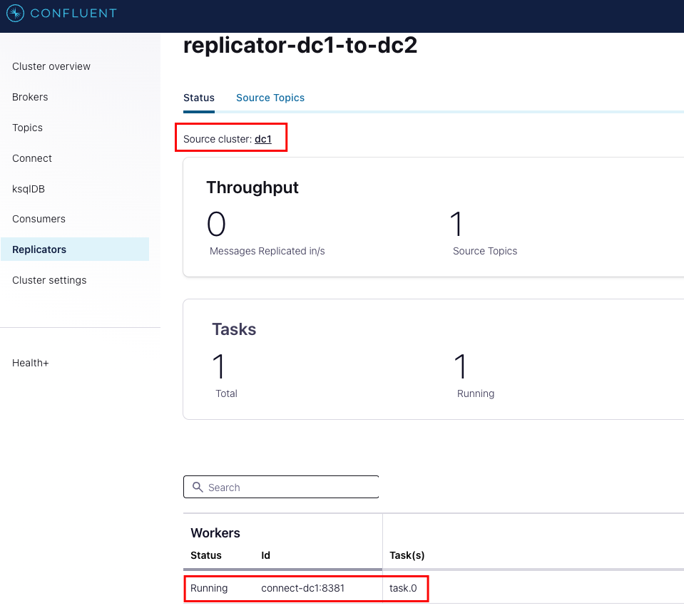
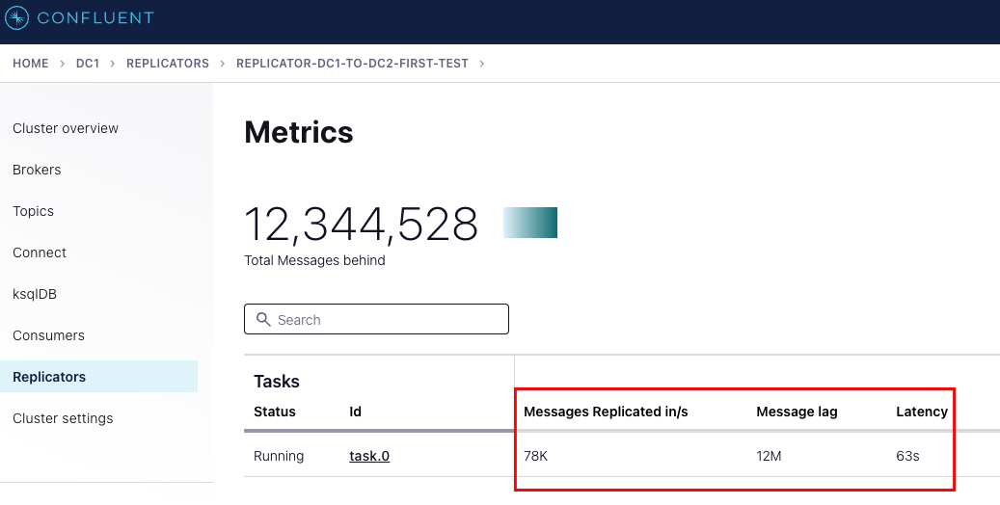

# 2 Data Centres with Replicator

The aim of this repository is to provide a very lightweight "2-data centre" project for simple performance testing and demoing Replicator.  It's configured to be lightweight so it can be run locally whilst also screensharing over a call.

The walkthrough in this README demonstrates creating some load on the broker in one DC and then configuring Replicator and subsequently tuning Replicator for better performance over a number of test scenarios.

## Getting started

The project will create the following infrastructure:

- Confluent Control Center (`control-center`) which will be configured to allow you to manage and inspect both Data Centers.

- Data Centre 1
  - Schema Registry (`schema-registry-dc1`)
  - Kafka Broker (`broker-dc1`)
  - Connect Worker (`connect-dc1`)

- Data Centre 2
  - Schema Registry (`schema-registry-dc2`)
  - Kafka Broker (`broker-dc2`)
  - Connect Worker (`connect-dc2`)

The brokers have been configured to run in KRaft mode, so there are no Zookeeper instances in use.  

The project has been configured to use Confluent Platform 7.6.0

> [!CAUTION]
> Note that the instances are configured with `KAFKA_ALLOW_EVERYONE_IF_NO_ACL_FOUND: "true"`; this is because Replicator requires ACLs to be in place on topics when you're copying data between clusters.  This setting should never be used in production.

In order to start the project, run the project in detached mode `-d`:

```bash
docker-compose up -d
```

-------

## Run the First Test

We will start by creating the `first-test` topic for replication:

```bash
docker-compose exec broker-dc1 kafka-topics --create --bootstrap-server broker-dc1:29091 --topic first-test --replication-factor 1 --partitions 1
```

You should see:

```bash
Created topic first-test.
```

Let's create the Replicator instance:

```bash
./first-test.sh
```

You should see:

```json
{"name":"replicator-dc1-to-dc2-first-test","config":{"connector.class":"io.confluent.connect.replicator.ReplicatorSourceConnector","src.consumer.interceptor.classes":"io.confluent.monitoring.clients.interceptor.MonitoringConsumerInterceptor","src.consumer.confluent.monitoring.interceptor.bootstrap.servers":"broker-dc2:29092","src.kafka.bootstrap.servers":"broker-dc1:29091","src.consumer.group.id":"replicator-connector-consumer-group","src.kafka.timestamps.topic.replication.factor":"1","dest.kafka.bootstrap.servers":"broker-dc2:29092","topic.whitelist":"first-test","key.converter":"io.confluent.connect.replicator.util.ByteArrayConverter","value.converter":"io.confluent.connect.replicator.util.ByteArrayConverter","header.converter":"io.confluent.connect.replicator.util.ByteArrayConverter","confluent.topic.replication.factor":"1","tasks.max":"1","topic.auto.create":"true","name":"replicator-dc1-to-dc2-first-test"},"tasks":[],"type":"source"}
```

To view a list of all Connectors using the Kafka Connect ReST API, run:

```bash
curl -H "Content-Type: application/json" -X GET http://localhost:8381/connectors/ | jq
```

You should see:

```json
["replicator-dc1-to-dc2-first-test"]
```

To view the Connector configuration (as JSON), you can run:

```bash
curl -H "Content-Type: application/json" -X GET http://localhost:8381/connectors/replicator-dc1-to-dc2-first-test | jq
```

If you navigate to Control Center <http://localhost:9021/>, select the **dc1** tile to inspect the first Data Centre, click on **Replicators** in the Navigation, you should be able to select the replicator instance to view the status of the connector:



Now let's create some load using `kafka-producer-perf-test`; this will create 10 million small records that need to be replicated:

```bash
docker-compose exec broker-dc1 kafka-producer-perf-test --throughput -1 --num-records 10000000 --topic first-test --record-size 10 --producer-props bootstrap.servers='broker-dc1:29091' acks=all
```

Click on the Throughput tile and you'll see the latency metrics for the Connector:



You can tear down the replicator instance for the first test by running:

```bash
curl -X DELETE http://localhost:8381/connectors/replicator-dc1-to-dc2 | jq
```

-------

## Run the Second Test

Let's start by tuning the Producer for the Replicator instance; we're going to add a few lines to give it some extra help:

```json
    "producer.override.linger.ms":"100",
    "producer.override.batch.size": "800000",
    "producer.override.compression.type":"lz4",
    "producer.override.acks":"all",
```

Note that for producer acks, we're specifying `all`, which is the default for any clients later than Apache Kafka version 3.0; it's not necessary in this case, but we can add it for the sake of completion.

Taken together, the above tuning settings provide what are normally considered to be the best options for getting the most out of your Producer:  

<https://developer.confluent.io/tutorials/optimize-producer-throughput/confluent.html>

We also need to configure the `override.policy` on the Connect Workers:

```json
    "connector.client.config.override.policy": "All",
```

Note that this is being done for you already for both Connect workers in the `docker-compose.yaml` file, so as soon as the `producer.override` settings are in place when the connector is created, the Connector settings will take precedence.

See:
- [How to override Producer and Consumer configurations for Source and Sink Connectors](https://support.confluent.io/hc/en-us/articles/21232790136340-How-to-override-Producer-and-Consumer-configurations-for-Source-and-Sink-Connectors)
- [How to setup Kafka Connect to use their own dedicated cluster separate from the Replicator source and destination clusters](https://support.confluent.io/hc/en-us/articles/360040036692-How-to-setup-Kafka-Connect-to-use-their-own-dedicated-cluster-separate-from-the-Replicator-source-and-destination-clusters)


-------

curl -H "Content-Type: application/json" -X GET http://localhost:8381/connectors/
```

docker-compose exec broker-dc1 kafka-acls --list --bootstrap-server broker-dc1:29091 --topic replicate-me

```bash

docker logs broker-dc2
```

## Prerequisites


--throughput -1

Create some sample data:


```bash
docker-compose exec broker-dc2 kafka-topics --list --bootstrap-server broker-dc2:29092
docker-compose exec broker-dc2 kafka-topics --describe --bootstrap-server broker-dc2:29092
docker-compose exec broker-dc2 kafka-topics --describe --topic replicate-me --bootstrap-server broker-dc2:29092
```


## Troubleshooting

Sometimes you need to just tear everything down and start again - as we're running the containers in detached mode, you can run the following to stop all associated containers and clean up:

```bash
docker-compose down && docker container prune -f
```

waiting for replication to catch up.  Please check replication lag

org.apache.kafka.common.errors.InvalidConfigurationException: topic.whitelist contains topics: [replicate-me] but these are either not present in the source cluster or are missing DES
CRIBE ACLs. Please make sure that the topics are allowed to DESCRIBE in ACLs
[2024-03-19 12:46:53,159] ERROR WorkerConnector{id=replicator-dc1-to-dc2} Connector raised an error (org.apache.kafka.connect.runtime.WorkerConnector)
org.apache.kafka.common.errors.InvalidConfigurationException: topic.whitelist contains topics: [replicate-me] but these are either not present in the source cluster or are missing DESCRIBE ACLs. Please make sure that the topics are allowed to DESCRIBE in ACLs

```bash
docker logs connect-dc1 --follow
```

```bash
docker-compose exec broker-dc1 kafka-acls --list --bootstrap-server broker-dc1:29091 --topic replicate-me
```


https://docs.confluent.io/platform/current/multi-dc-deployments/replicator/replicator-verifier.html

Run the replicator verifier:

```bash
docker-compose exec connect-dc1 replicator-verifier \
 --connect-url connect-dc1:8381 \
 --connector-name replicator-dc1-to-dc2
```

[2024-03-19 13:07:05,951] ERROR Unexpected exception in topic monitor thread (io.confluent.connect.replicator.NewTopicMonitorThread)
org.apache.kafka.common.errors.InvalidConfigurationException: topic.whitelist contains topics: [replicate-me] but these are either not present in the source cluster or are missing DESCRIBE ACLs. Please make sure that the topics are allowed to DESCRIBE in ACLs
[2024-03-19 13:07:05,951] ERROR WorkerConnector{id=replicator-dc1-to-dc2} Connector raised an error (org.apache.kafka.connect.runtime.WorkerConnector)
org.apache.kafka.common.errors.InvalidConfigurationException: topic.whitelist contains topics: [replicate-me] but these are either not present in the source cluster or are missing DESCRIBE ACLs. Please make sure that the topics are allowed to DESCRIBE in ACLs


[2024-03-19 12:47:03,174] ERROR [Worker clientId=connect-1, groupId=connect-dc1] Failed to reconfigure connector's tasks (replicator-dc1-to-dc2), retrying after backoff. (org.apache.k
afka.connect.runtime.distributed.DistributedHerder)
org.apache.kafka.connect.errors.ConnectException: Could not obtain timely topic metadata update from source cluster
        at io.confluent.connect.replicator.NewTopicMonitorThread.assignments(NewTopicMonitorThread.java:168)
        at io.confluent.connect.replicator.ReplicatorSourceConnector.taskConfigs(ReplicatorSourceConnector.java:114)
        at org.apache.kafka.connect.runtime.Worker.connectorTaskConfigs(Worker.java:479)
        at org.apache.kafka.connect.runtime.distributed.DistributedHerder.reconfigureConnector(DistributedHerder.java:2103)
        at org.apache.kafka.connect.runtime.distributed.DistributedHerder.reconfigureConnectorTasksWithExponentialBackoffRetries(DistributedHerder.java:2047)
        at org.apache.kafka.connect.runtime.distributed.DistributedHerder.reconfigureConnectorTasksWithRetry(DistributedHerder.java:2034)
        at org.apache.kafka.connect.runtime.distributed.DistributedHerder.lambda$null$38(DistributedHerder.java:1979)
        at org.apache.kafka.connect.runtime.distributed.DistributedHerder.runRequest(DistributedHerder.java:2254)
        at org.apache.kafka.connect.runtime.distributed.DistributedHerder.tick(DistributedHerder.java:471)
        at org.apache.kafka.connect.runtime.distributed.DistributedHerder.run(DistributedHerder.java:372)
        at java.base/java.util.concurrent.Executors$RunnableAdapter.call(Executors.java:515)
        at java.base/java.util.concurrent.FutureTask.run(FutureTask.java:264)
        at java.base/java.util.concurrent.ThreadPoolExecutor.runWorker(ThreadPoolExecutor.java:1128)
        at java.base/java.util.concurrent.ThreadPoolExecutor$Worker.run(ThreadPoolExecutor.java:628)