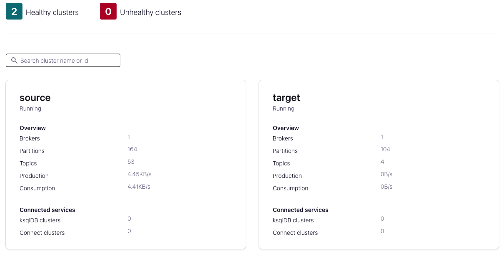

# Schema Linking - Bidirectional

In this example, Confluent Control Center (C3) has been configured to monitor both clusters:



## Troubleshooting: testing the Metrics output

Note that for C3 to work, all the metrics are being collected on the first broker (in the `source` cluster).

For the first broker (`src`):

```bash
docker exec broker kafka-console-consumer --topic _confluent-metrics --bootstrap-server broker:9091 --formatter io.confluent.metrics.reporter.ConfluentMetricsFormatter
```

Create a topic on the target cluster:

```bash
docker-compose exec broker2 kafka-topics --bootstrap-server broker2:9092 --topic cluster-link-topic --replication-factor 1 --partitions 1 --create --config min.insync.replicas=1
```

```bash
docker-compose exec broker2 kafka-topics --bootstrap-server broker2:9092 --topic product --create --partitions 1 --replication-factor 1
```

## Create some load with the `kafka-producer-perf-test`

```bash
docker-compose exec broker2 kafka-producer-perf-test --throughput -1 --num-records 1000000 --topic product --record-size 1000 --producer-props bootstrap.servers=broker2:29092 acks=all
```

## Create some consumer load with `kafka-consumer-perf-test`

```bash
docker-compose exec broker2 kafka-consumer-perf-test --broker-list broker2:9092 --topic product --messages 10000000 --print-metrics
```

## Create some pageviews with the `pageviews` quickstart using the `datagen` Connector

```bash
curl -i -X PUT http://localhost:8083/connectors/datagen_local_01/config \
     -H "Content-Type: application/json" \
     -d '{
            "connector.class": "io.confluent.kafka.connect.datagen.DatagenConnector",
            "key.converter": "org.apache.kafka.connect.storage.StringConverter",
            "kafka.topic": "pageviews",
            "quickstart": "pageviews",
            "max.interval": 1000,
            "iterations": 10000000,
            "tasks.max": "1"
        }'
```

Confirm that the connector is running:

```bash
curl -s http://localhost:8083/connectors/datagen_local_01/status | jq
```

Check the `pageviews` topic using the `kafka-avro-console-consumer`:

```bash
docker-compose exec connect kafka-avro-console-consumer \
 --bootstrap-server broker:29091 \
 --property schema.registry.url=http://schemaregistry:8081 \
 --topic pageviews \
 --property print.key=true \
 --property key.deserializer=org.apache.kafka.common.serialization.StringDeserializer \
 --property key.separator=" : " \
 --max-messages 10
```

You should see lots of messages like this:

```json
{"viewtime":321,"userid":"User_5","pageid":"Page_61"}
```

## Create more data

Let's create some Pizza orders using the `pizza_orders` quickstart:

```bash
curl -i -X PUT http://localhost:8083/connectors/datagen_local_02/config \
     -H "Content-Type: application/json" \
     -d '{
            "connector.class": "io.confluent.kafka.connect.datagen.DatagenConnector",
            "key.converter": "org.apache.kafka.connect.storage.StringConverter",
            "kafka.topic": "pizza_orders",
            "quickstart": "pizza_orders",
            "max.interval": 1000,
            "iterations": 10000000,
            "tasks.max": "1"
        }'
```

To check the structure of the data:

```bash
docker-compose exec connect kafka-avro-console-consumer \
 --bootstrap-server broker:29091 \
 --property schema.registry.url=http://schemaregistry:8081 \
 --topic pizza_orders \
 --property print.key=true \
 --property key.deserializer=org.apache.kafka.common.serialization.StringDeserializer \
 --property key.separator=" : " \
 --max-messages 10
```

And here's an example:

```json
{"store_id":2,"store_order_id":1137,"coupon_code":1924,"date":18314,"status":"accepted","order_lines":[{"product_id":69,"category":"salad","quantity":3,"unit_price":17.07,"net_price":51.21},{"product_id":4,"category":"wings","quantity":4,"unit_price":3.52,"net_price":14.08}]}
```

A list of quickstarts can be found here:

<https://github.com/confluentinc/kafka-connect-datagen/tree/master/src/main/resources>

```bash
curl -i -X PUT http://localhost:8083/connectors/datagen_local_03/config \
     -H "Content-Type: application/json" \
     -d '{
            "connector.class": "io.confluent.kafka.connect.datagen.DatagenConnector",
            "key.converter": "org.apache.kafka.connect.storage.StringConverter",
            "kafka.topic": "device_information",
            "quickstart": "device_information",
            "max.interval": 1000,
            "iterations": 10000000,
            "tasks.max": "1"
        }'
```

To read some of the data from the `device_information` topic:

```bash
docker-compose exec connect kafka-avro-console-consumer \
 --bootstrap-server broker:29091 \
 --property schema.registry.url=http://schemaregistry:8081 \
 --topic device_information \
 --property print.key=true \
 --property key.deserializer=org.apache.kafka.common.serialization.StringDeserializer \
 --property key.separator=" : " \
 --max-messages 10
```

Example data includes:

```json
{"device_ip":"157.200.87.61","mac_address":"F8-E2-9D-20-DA-2B","owner":"Cyril Yellowlea"}
```

Let's create some stock trade data:

```bash
curl -i -X PUT http://localhost:8083/connectors/datagen_local_04/config \
     -H "Content-Type: application/json" \
     -d '{
            "connector.class": "io.confluent.kafka.connect.datagen.DatagenConnector",
            "key.converter": "org.apache.kafka.connect.storage.StringConverter",
            "kafka.topic": "stock_trades",
            "quickstart": "stock_trades",
            "max.interval": 1000,
            "iterations": 10000000,
            "tasks.max": "1"
        }'
```

```bash
docker-compose exec connect kafka-avro-console-consumer \
 --bootstrap-server broker:29091 \
 --property schema.registry.url=http://schemaregistry:8081 \
 --topic stock_trades \
 --property print.key=true \
 --property key.deserializer=org.apache.kafka.common.serialization.StringDeserializer \
 --property key.separator=" : " \
 --max-messages 10
```

Example output:

```json
{"side":"SELL","quantity":1004,"symbol":"ZTEST","price":506,"account":"LMN456","userid":"User_1"}
```

## Working with the Connect Worker

To get overall information about the Worker:

```bash
curl -XGET  http://localhost:8083
```

To view all available connector plugins:

```bash
curl -XGET  http://localhost:8083/connector-plugins/ | jq
```

To view all available connectors:

```bash
curl -XGET  http://localhost:8083/connectors
```

```bash
curl -XGET  http://localhost:8083/connectors/datagen_local_01 | jq
```

```bash
curl -XGET  http://localhost:8083/connectors/datagen_local_01/tasks/0/status | jq
```

## Configure Schema Linking from the `source` to the `target` Schema Registry

```bash
docker-compose exec schemaregistry schema-exporter --create --name src-to-tgt-link --subjects "pageviews-value" \
    --config-file /tmp/config/schemalink-src.cfg \
    --schema.registry.url http://schemaregistry:8081 \
    --subject-format "source.pageviews-value" \
    --context-type NONE
```

You will see something like this:

```
Successfully created exporter src-to-tgt-link
```

Confirm that the link works and is available:

```bash
docker-compose exec schemaregistry schema-exporter --list --schema.registry.url http://schemaregistry:8081
```

You should see:

```
[src-to-tgt-link]
```

```bash
docker-compose exec schemaregistry schema-exporter --get-status --name src-to-tgt-link --schema.registry.url http://schemaregistry:8081 | jq
```

You will see something like:

```json
{
  "name": "src-to-tgt-link",
  "state": "RUNNING",
  "offset": 2,
  "ts": 1697640995555
}
```

### Retrieve the Schema on both sides

Let's retrieve the schema from the `source` cluster:

```bash
curl http://localhost:8081/subjects/pageviews-value/versions/1 | jq
```

And now, let's retrieve the schema from the `target` cluster:

```bash
curl http://localhost:8082/subjects/source.pageviews-value/versions/1 | jq
```

Standard producer:

```bash
docker-compose exec broker kafka-console-producer --bootstrap-server broker:29091 --topic cluster-link-topic
```

## `ssh` into the instance

```bash
docker-compose exec broker bash
```

docker-compose exec broker curl -XGET localhost:8091

## Confirm the ReST endpoints work for both clusters

You can issue a cURL request to `/v1/metadata/id` on the brokers for both clusters to ensure they're working as expected:

The broker for the `source` cluster is listening on port **8090**:

```bash
curl -XGET localhost:8090/v1/metadata/id
```

The broker for the `target` cluster is listening on port **8091**:

```bash
curl -XGET localhost:8091/v1/metadata/id
```

## Notes below

Note that MetricsReporter (or more accurately, C3) requires that a single topic is used by the Metrics reporter (for the `_confluent-metrics` topic).  If you set each cluster up with a separate MetricsReporter (each writing to a separate `_confluent-metrics` topic), C3 will only report (or show) metrics for one of the two clusters.

For the second broker (`tgt`):

```bash
docker exec broker2 kafka-console-consumer --topic _confluent-metrics --bootstrap-server broker2:9092 --formatter io.confluent.metrics.reporter.ConfluentMetricsFormatter
```
