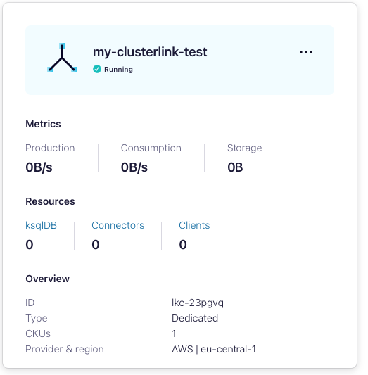
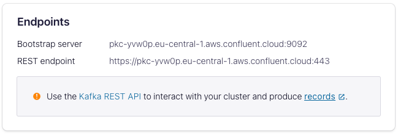
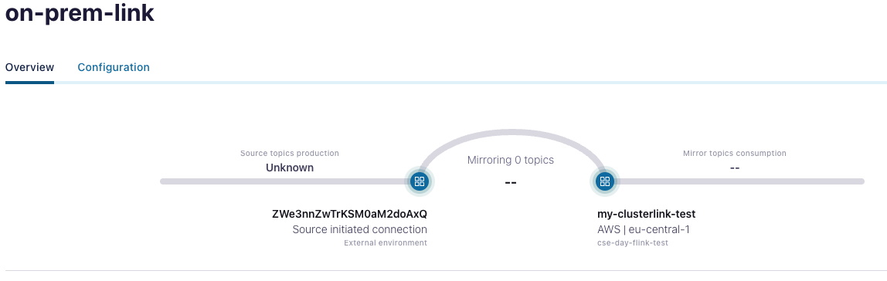
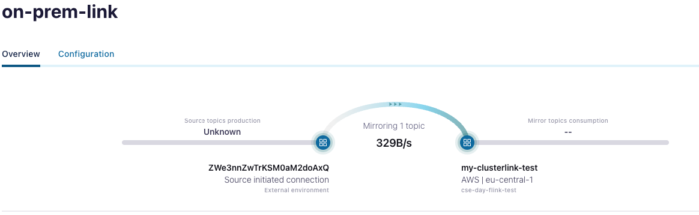

# Confluent Platform (on-prem) Cluster Link to Confluent Cloud

We're going to create a Source Initiated Cluster Link from an on-prem Confluent Platform Cluster to a Dedicated Cluster in Confluent Cloud.

## Prerequisites

Create a **Dedicated** cluster in Confluent Cloud to test this:

Log into <https://confluent.cloud/>

Select an Environment and click on **Add Cluster**

Choose Dedicated Cluster:


Select your Geographic region and Cloud Provider (and availability):


Select the option for Public Internet:


Select Automatic so your keys are managed by your cloud provider:


Give your cluster a name:


Wait for the cluster to be provisioned:


Select the cluster as soon as it has been provisioned:



On the left-hand menu, select **API Keys** and **Create Key**

For scope, give the key Global Access:


Give it a name and download the text file.

## Note for Zookeeper users

The default `docker-compose.yaml` is configured for KRaft mode.  

There is an alternative `docker-compose-zookeeper.yaml` provided those who wish to follow the walkthrough using a Zookeeper managed cluster instead - in either case, we expect all steps to be the same.

## KRaft mode prerequisites

For KRaft mode to work (for the controllers and the brokers to be able to identify each other), the `CLUSTER_ID` is hard-coded into the `docker-compose` file.  

If you wish to change this, you can use the `kafka-storage` command to generate a new UUID:

```bash
docker-compose exec broker kafka-storage random-uuid
```

## Create the configuration and the Secret

To create the secret for Confluent Cloud, you need to combine the key and secret from the text file that you have just downloaded to create a base64-encoded string:

```bash
echo -n "KEY:SECRET" | base64
```

Paste the output from this command into `security/ccloud_creds`, replacing the placeholder line with your command output.  Note that the file in the repository has the name `ccloud_creds_example`; the filename needs to be changed in order for the credentials to be read.

In a terminal session, start up the Confluent Platform side to create your broker (and the zookeeper instance - if you are running the `docker-compose-zookeeper.yaml`):

```bash
docker-compose up
```

As soon as this is done, we will need to get the Cluster ID - to do this, we can run the `kafka-cluster` command on the container:

```bash
docker-compose exec broker kafka-cluster cluster-id --bootstrap-server broker:9092
```

You should see something like:

```bash
Cluster ID: ZWe3nnZwTrKSM0aM2doAxQ
```

We will also need the bootstrap server URL for configuration to take place; to do this click on **Cluster Settings** under the Cluster Overview section of the navigation; the endpoints will be listed under that section:



Now we're ready to start preparing the Cluster Link.

## Create the Cluster Link on the Confluent Cloud side

Open `client/ccloud-cluster-link.properties` and replace the following **three** sections:

- << dedicated instance bootstrap host >> with your **bootstrap host**.
- << KEY >> with your API Key
- << SECRET >> with your Secret

Prior to modification, the file should look like this:

```properties
link.mode=DESTINATION
connection.mode=INBOUND

bootstrap.servers=<< dedicated instance bootstrap host >>:9092
ssl.endpoint.identification.algorithm=https
security.protocol=SASL_SSL
sasl.mechanism=PLAIN
sasl.jaas.config=org.apache.kafka.common.security.plain.PlainLoginModule required username="<< KEY >>" password="<< SECRET >>";

local.listener.name=PLAINTEXT_HOST
local.security.protocol=PLAINTEXT
local.sasl.mechanism=PLAIN
```

Now log in using the Confluent CLI and run the following:

Set the correct environment for the dedicated cluster:

```bash
confluent environment list
confluent environment use <id>
```

Select the dedicated cluster within the environment:

```bash
confluent kafka cluster list
confluent kafka cluster use <id>
```

```bash
confluent kafka link create on-prem-link --cluster <ccloud cluster> --source-cluster <cp cluster> --config-file client/ccloud-cluster-link.properties
```

For example:

```bash
confluent kafka link create on-prem-link --cluster lkc-23pgvq --source-cluster ZWe3nnZwTrKSM0aM2doAxQ --config-file client/ccloud-cluster-link.properties
```

You should see:

```bash
Created cluster link "on-prem-link" with configs:
"bootstrap.servers"="pkc-yvw0p.eu-central-1.aws.confluent.cloud:9092"
"connection.mode"="INBOUND"
"link.mode"="DESTINATION"
"local.sasl.mechanism"="PLAIN"
"local.security.protocol"="PLAINTEXT"
"sasl.mechanism"="PLAIN"
"security.protocol"="SASL_SSL"
```

To confirm that the link has been created, run:

```bash
confluent kafka link list
```

You should see something like:

```
      Name     |     Source Cluster     | Destination Cluster |     Remote Cluster     | State  | Error | Error Message
---------------+------------------------+---------------------+------------------------+--------+-------+----------------
  on-prem-link | ZWe3nnZwTrKSM0aM2doAxQ |                     | ZWe3nnZwTrKSM0aM2doAxQ | ACTIVE |       |
```

To view the link in Confluent Cloud, you can go to <https://confluent.cloud/cluster-links> and click on `on-prem-link`, you'll see something like this:



In order to complete the link and to start mirroring topics, we now need to create the link going from the source (CP) cluster.

## Create the Cluster Link on the Confluent Platform (aka: "on prem") side

Open `client/cp-cluster-link.properties` and replace the following **three** sections:

- << dedicated instance bootstrap host >> with your **bootstrap host**.
- << KEY >> with your API Key
- << SECRET >> with your Secret

Prior to modification, the file should look like this:

```properties
link.mode=SOURCE
connection.mode=OUTBOUND

bootstrap.servers=<< dedicated instance bootstrap host >>:9092
ssl.endpoint.identification.algorithm=https
security.protocol=SASL_SSL
sasl.mechanism=PLAIN
sasl.jaas.config=org.apache.kafka.common.security.plain.PlainLoginModule required username="<< KEY >>" password="<< SECRET >>";

local.listener.name=PLAINTEXT_HOST
local.security.protocol=PLAINTEXT
local.sasl.mechanism=PLAIN
```

To set up the link from the source, let's now `ssh` to the CP instance:

```bash
docker-compose exec broker bash
```

As soon as you have a shell connection to the CP `broker` instance, run these commands against the broker:

```bash
kafka-cluster-links --bootstrap-server broker:9092 --create --link on-prem-link --config-file /tmp/client/cp-cluster-link.properties --cluster-id lkc-23pgvq --command-config /tmp/client/cp-config.properties
```

You should see:

```
Cluster link 'on-prem-link' creation successfully completed.
```

Create a topic, produce to it and mirror it

```bash
kafka-topics --bootstrap-server broker:9092 --topic cluster-link-topic --replication-factor 1 --partitions 1 --create --config min.insync.replicas=1'
```

You should see:

```
Created topic cluster-link-topic.
```

Let's run the `kafka-console-producer` and write some data to the topic:

```bash
kafka-console-producer --bootstrap-server broker:9092 --topic cluster-link-topic
```

Now let's mirror that topic over the Cluster Link **note**: this mirror is created on your dedicated cluster in Confluent Cloud (don't try running this on the shell session on the CP cluster):

```bash
confluent kafka mirror create cluster-link-topic --link on-prem-link
```

You should see the following output:

```
Created mirror topic "cluster-link-topic".
```

You'll see evidence that the messages are now being mirrored if you view the Cluster Link in the Confluent Cloud UI:



## Reading messages from the Mirror Topic

Let's try to consume our messages from the mirror topic.  First we need to create an API Key (on the dedicated instance) to allow us to read from the topic:

```bash
confluent api-key create --resource <cluster-id>
```

Where `<cluster-id>` is the ID for your dedicated cluster.

Note that this will output a Key and Secret to `stdout` - store it for use later.

Using the API Key, we now need to associate it with our cluster:

```bash
confluent api-key use <API Key> --resource <cluster-id>
```

You should now be able to read from the mirror topic by running:

```bash
confluent kafka topic consume -b cluster-link-topic
```

### Notes below

When creating a Mirror if the **destination** is a CP Cluster, you'd use the following syntax (for example):

```bash
kafka-mirrors --create --mirror-topic cluster-link-topic --link on-prem-link --bootstrap-server broker:9092
```
