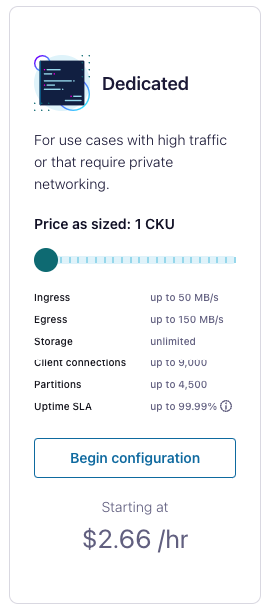
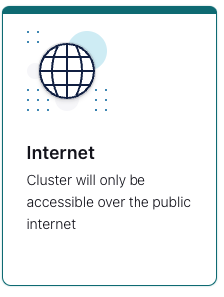
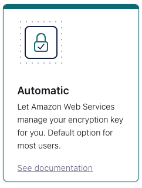
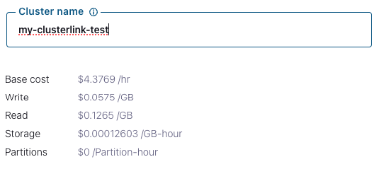
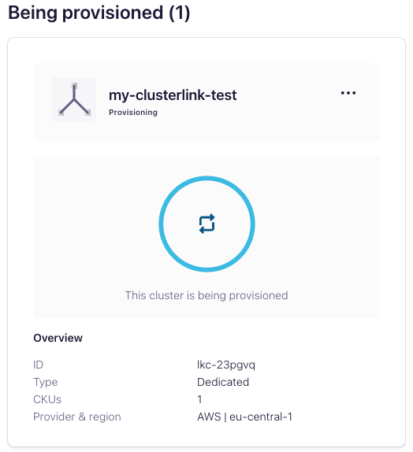
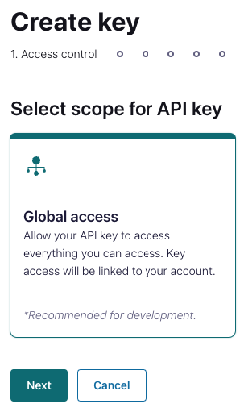

# Confluent Platform (on-prem) Cluster Link to Confluent Cloud

We're going to create a Source Initiated Cluster Link from an on-prem Confluent Platform Cluster to a Dedicated Cluster in Confluent Cloud.

## Prerequisites

Create a **Dedicated** cluster in Confluent Cloud to test this:

Log into <https://confluent.cloud/>

Select an Environment and click on **Add Cluster**

Choose Dedicated Cluster:



Select your Geographic region and Cloud Provider (and availability):


Select the option for Public Internet:



Select Automatic so your keys are managed by your cloud provider:



Give your cluster a name:



Wait for the cluster to be provisioned:



Select the cluster as soon as it has been provisioned:


On the left-hand menu, select **API Keys** and **Create Key**

For scope, give the key Global Access:



Give it a name and download the text file.

## Create the configuration and the Secret


To create the secret for Confluent Cloud:

```bash
echo -n "KEY:SECRET" | base64
```

## Create the Cluster Link on the Confluent Cloud side


```properties
bootstrap.servers=<< dedicated instance bootstrap host >>:9092
ssl.endpoint.identification.algorithm=https
security.protocol=SASL_SSL
sasl.mechanism=PLAIN
sasl.jaas.config=org.apache.kafka.common.security.plain.PlainLoginModule required username="<< KEY >>" password="<< SECRET >>";
link.mode=DESTINATION
#link.mode=SOURCE
connection.mode=INBOUND

local.listener.name=PLAINTEXT_HOST
local.security.protocol=PLAINTEXT
local.sasl.mechanism=PLAIN
```

## Create the Cluster Link on the Confluent Platform (aka: "on prem") side
