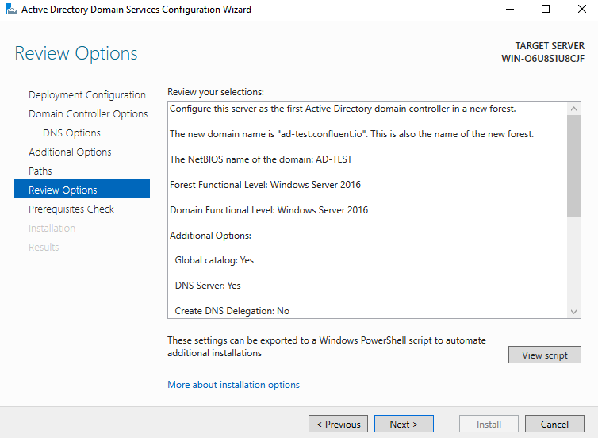

# Windows Server 2022 with Active Directory and Confluent Platform 7.5.1 with C3

This project covers the steps required to set up a test Windows Server with Active Directory and to configure it to be used with Confluent Control Center (C3).

## Getting Started

First, you'll need to download a trial version of Windows Server 2022:

<https://www.microsoft.com/en-us/evalcenter/download-windows-server-2022>

Download the `ISO download`: `64-bit edition`

### Configure Virtualbox VM Settings

Now we're going to configure the Display settings for the VM in VirtualBox:


And we should set the networking to `Bridged Mode` and we'll bind it to our network adaptor:


### Install Windows Server 2022 and Configure Active Directory

Install / Run VirtualBox and create a new VM:

Make sure the path to the ISO file is correct and that the checkbox to skip an unattended installation (`Skip Unattended Installation`) is selected:


Configure the available memory and CPU resources (and note that you will need to reserve some for running Confluent Platform):


Configure the available disk for the base OS:


### Begin the Installation

When the ISO boots up, start by configuring the language settings:


And we're going to install the Datacenter edition with the Desktop Experience:


Next, Windows Server will boot and ask you to configure your `Administrator` password:


### Log in

In order to log in, you need to issue the `Ctrl+Alt+Delete` key combination; in VirtualBox, you can do this by navigating to the **Input** > **Keyboard** > **Insert Ctrl-Alt-Del** menu option:


As soon as you do this, you'll be able to enter the Administrator password to log in:


### Install VirtualBox Guest Additions

In order to install the Guest Additions in Windows, you can navigate to the **Devices** menu and select **Insert Guest Additions CD Image**.  As soon as this is done, you should see ISO mounted in Windows Explorer:


Begin the installation by clicking on the necessary installer for your architecture (in our case, it's `amd64`):


Note that you will need to reboot after these have been installed.

### Configure Active Directory

On restart, we can now set up Active Directory and prepare the stage for configuring Confluent Platform and Confluent Control Center.

Starting up, you'll see the `Server Manager` GUI:


This will start the **Add Roles and Features Wizard**:


From there, select **Role-based or feature-based installation**:


In our case, the server is already selected (it's a pool of one..):


The next stage will be to add more roles - and we're going to add **Active Directory Domain Services**.  Note that there will be an additional window opened as soon as you select this; confirm by clicking on **Add Features** and finally click **Next**:


Now we can choose any additional features; in this case, we can just click **Next**:


In the next section, you'll see some general information about **Active Directory Domain Services**, so click **Next**:


Finally, check **Restart the destination server if required** and click **Install**:


You can see the progress indicator as all the components are installed and configured:s


### Post Install: Deployment Configuration

Note that after the installation is complete, you'll see an alert for post-deployment:


First, we're going to select **Add a new Forest** and then give your domain an appopriate name (in this example, we're using `adtest.confluent.io`):


Next we need to set up a password:


Next, we'll set up DNS - just click Next in this case:


Next, verify the `NetBIOS` name:


Confirm the default paths:


Now we're going to review everything that we have set so far:



This will be followed by a prerequisites check - this may take some time to complete.  If everything worked as expected, you should see a message stating that **"All prerequisite checks passed successfully"**.  If so, you can click on **Install**:


You should see that the process ran to completion; the server will now restart for all the changes to take effect:


After restarting, log in and search for `dsa` and select `Active Directory Users and Computers`:


This will give us the view of the directory:


Let's test the connection using `ldapsearch`. First, we need to determine the ip address of the VM - open Powershell and run `ipconfig` and note the IP address next to the IPv4 Address, From there, substitute the IP address and run the command below to search the directory as the `Administrator` user:

```bash
ldapsearch -x -b "CN=Users,DC=ad-test,DC=confluent,dc=io" -H ldap://<IP_ADDR> -D "cn=Administrator,CN=Users,DC=ad-test,DC=confluent,DC=io" -W
```

For example:

```bash
ldapsearch -x -b "CN=Users,DC=ad-test,DC=confluent,dc=io" -H ldap://192.168.1.248 -D "cn=Administrator,CN=Users,DC=ad-test,DC=confluent,DC=io" -W
```

In order to confirm the values for the `-b` and `-D` switches in the above example, we can use `Active Directory Users and Computers`; first we need to enable `Advanced Features` under the `View` menu:


From there, select the `Administrator` user and look at the `distinguishedName` field under the `Attribute Editor`:


