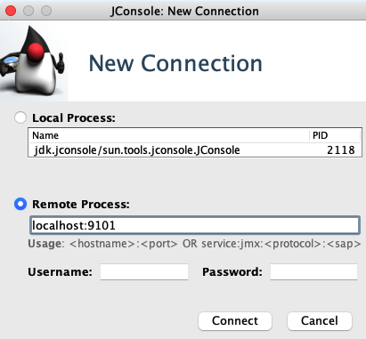
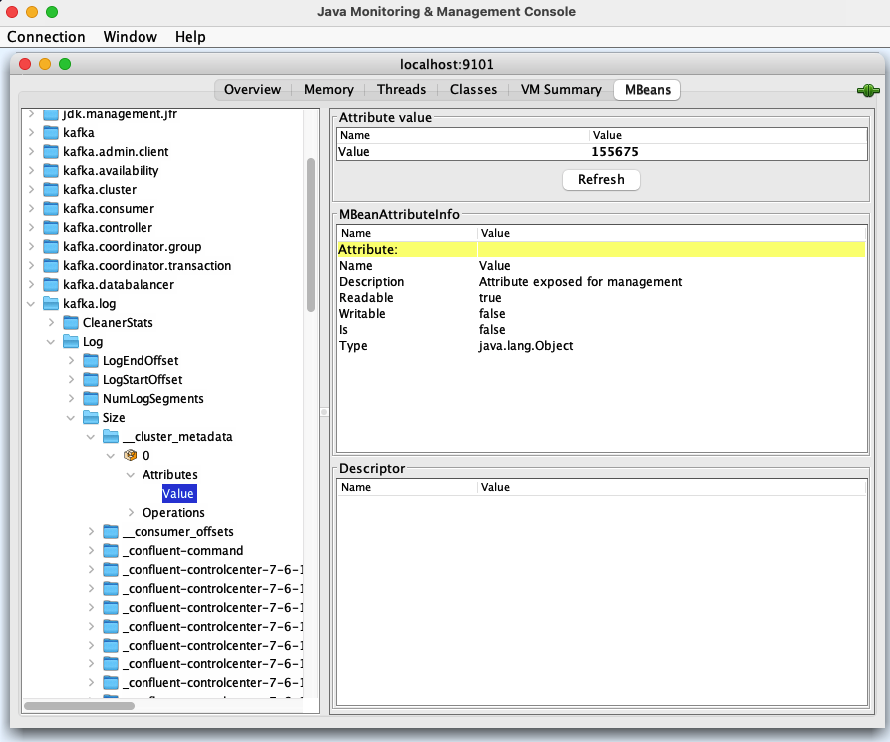

```bash
docker-compose up
```

docker exec -it broker /bin/bash

## JConsole

```bash
jconsole
```





### Jolokia

```bash
curl -s localhost:8778/jolokia/list | python3 -m json.tool
```

export KAFKA_JMX_OPTS="-Dcom.sun.management.jmxremote -Dcom.sun.management.jmxremote.port=9999 -Dcom.sun.management.jmxremote.ssl=false -Dcom.sun.management.jmxremote.authenticate=false"